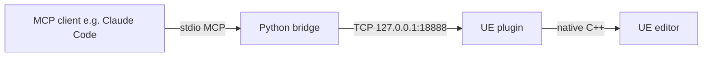

# AI Integration

Driving UE from LLMs and AI tools. Two distinct categories:

| Category | Examples | Section |
| --- | --- | --- |
| **In-editor AI tooling** — LLM controls the UE editor over a socket | UnrealClaudeMCP, Unreal AI Connection | This page |
| **In-game AI** — Behavior Trees, EQS, Mass AI | (not covered here — separate field) | UE docs |

## Pages

- [UnrealClaudeMCP](unreal-claude-mcp.md) — 64 native MCP tools
- [Unreal AI Connection](unreal-ai-connection.md) — 105-tool fork/sibling
- [Claude Code Game Studios](ccgs.md) — Claude Code template (not a UE plugin)
- [UnrealJS](unreal-js.md) — V8 inside UE for JavaScript scripting

## What problem are we solving?

UE's Python API has known dead-ends (e.g. `EditorUtilityWidgetBlueprint.WidgetTree` not exposed). LLM-driven workflows need:

1. A **stable, JSON-RPC-style protocol** the LLM can call
2. **Native C++ handlers** that bypass Python reflection limits
3. Comprehensive tool surface (asset registry, level editing, BP introspection, Python escape hatch)
4. A **local TCP** path (no cloud, no auth dance, instant)

UnrealClaudeMCP solves this.

## MCP (Model Context Protocol)

Anthropic's vendor-neutral protocol for LLM tool use. Each tool exposes a name, JSON schema, and a callable handler. Clients (Claude Code, Cursor, Codex CLI, …) speak MCP over `stdio` to a bridge process; the bridge proxies to UE via local TCP.

## Quick start

1. Install `UnrealClaudeMCP` plugin into your UE project (`Plugins/`)
2. Build editor — handlers register on startup
3. Configure your MCP client to point at the bridge script
4. Test with `examples/smoke_test.py`

See the per-tool pages for full reference.

## Workflows enabled

- "Spawn a cube at origin, focus the camera on it, take a screenshot"
- "Inspect this Editor Utility Widget and propose a layout fix"
- "Audit all Blueprint compile errors"
- "Bulk rename all assets in /Game/Items to PascalCase"
- "Compile a mod PAK"
- "Find unused assets and list their disk footprint"

All of these are **tool calls** the LLM emits, not "type in the editor for me" pixel-clicking.
