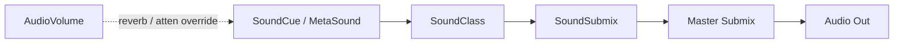

# Audio

UE 5.7's audio stack has three eras of tech:

| Era | What |
| --- | --- |
| Legacy | `USoundCue` (still works, still useful) |
| Modern | **MetaSounds** (procedural DSP) |
| Middleware | Wwise / FMOD plugins (industry standard for AAA) |

## Pages

- [MetaSounds](metasounds.md) — modern procedural audio
- [Sound Cues](sound-cues.md) — legacy graph
- [Sound Classes](sound-classes.md) — bus / category routing
- [Audio Volumes](audio-volumes.md) — region-based reverb / occlusion
- [Quartz](quartz.md) — sample-accurate scheduling

## Asset taxonomy

| Asset | Role |
| --- | --- |
| `USoundWave` | Audio file |
| `USoundCue` | Legacy DSP-light graph |
| `UMetaSoundSource` | Modern procedural source |
| `UMetaSoundPatch` | Reusable MetaSound subgraph |
| `USoundClass` | Group of sources with shared properties |
| `USoundSubmix` | Output routing bus |
| `USoundAttenuation` | 3D distance / cone settings |
| `UReverbEffect` | Reverb preset |
| `USoundMix` | Mix snapshot (volume per class) |
| `UDialogueWave` | Localized dialogue |
| `USoundConcurrency` | Voice-count limits |

## Signal flow

## Choosing source type

| Need | Use |
| --- | --- |
| Static audio with randomization | SoundCue or MetaSound |
| Procedural sound (engine, footsteps with timing) | MetaSound |
| Cross-fades, transitions, complex mixes | MetaSound |
| AAA audio production with middleware-grade authoring | Wwise / FMOD |
| Music with sample-accurate beats | MetaSound + Quartz |

## Performance

- `Concurrency` settings cap simultaneous voices per source.
- Profile with `stat audio`, `au.audiothread.usagetreshold`.
- MetaSounds are evaluated per-source on the audio thread — heavy graphs add CPU.
