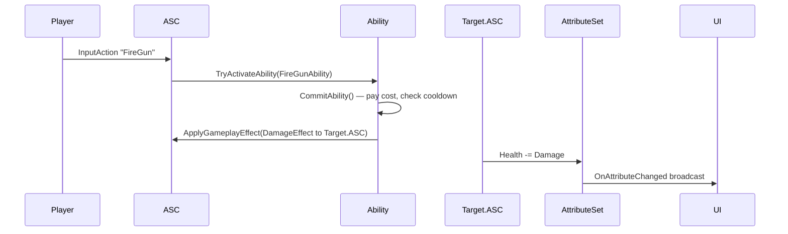

# Gameplay Ability System (GAS)

GAS is UE's typed gameplay logic framework. It models abilities, attributes, gameplay effects, and tags in a replicated, predictable, designer-friendly way. Used by Lyra and most modern AAA gameplay built on UE 5.

## Enable

`Project Settings → Plugins → Gameplay Abilities` → restart.

## Core types

| Class | Purpose |
| --- | --- |
| `UAbilitySystemComponent` (ASC) | Attached to a Pawn/Character; the GAS hub |
| `UGameplayAbility` | An ability — granted to ASCs, can be activated |
| `UGameplayEffect` | A modifier — applies to attributes (damage, buffs) |
| `UAttributeSet` | A typed set of replicated attributes |
| `FGameplayTag` | Hierarchical tags (e.g. `State.Status.Stunned`) |
| `UGameplayCue` | Cosmetic effects fired by tag (sounds, VFX) |

## Activation flow



## Attributes

`UAttributeSet` declares replicated floats:

```cpp
UCLASS()
class UHeroAttributeSet : public UAttributeSet
{
    GENERATED_BODY()
public:
    ATTRIBUTE_ACCESSORS(UHeroAttributeSet, Health);
    UPROPERTY(BlueprintReadOnly, ReplicatedUsing=OnRep_Health)
    FGameplayAttributeData Health;
    UFUNCTION() void OnRep_Health(const FGameplayAttributeData& Old);
};
```

## Gameplay Effects

Three durations:

- **Instant** — single change (heal +20)
- **Duration** — temporary buff (10 s strength boost)
- **Infinite** — until removed by tag/effect

Effects can apply modifiers, grant abilities, or fire gameplay cues.

## Tags

Hierarchical strings: `Ability.Combat.Slash` matches a tag query for `Ability.Combat.*`. Tag tables drive ability requirements, cancel/block rules, and gameplay cue routing.

## Prediction

GAS supports **client-side prediction** with server reconciliation — the client guesses the ability's outcome, the server validates, mismatches trigger rollback. For each ability, set:

```cpp
NetExecutionPolicy = EGameplayAbilityNetExecutionPolicy::LocalPredicted;
```

## When to use vs hand-rolled gameplay

| Need | GAS | Hand-rolled |
| --- | --- | --- |
| Attribute mutation w/ replication | ★ | Lots of boilerplate |
| Effect stacking / cancellation rules | ★ | Custom queue |
| Designer-tunable effects | ★ | Hardcoded |
| Tag-driven AI state | ★ | Manual flags |
| Very simple games | Overkill | ★ |

## Gotchas

- The ASC must be **replicated** for multiplayer GAS. Default Lyra setup handles this.
- **AttributeSet initialization** order matters — set defaults in the ASC's `BeginPlay` or via a startup `UGameplayEffect`.
- Abilities authored as BP Blueprints have slower activation than C++ abilities; keep critical path abilities in C++.

## See also

- [Lyra Starter Game (source)](https://github.com/EpicGames/Lyra) — reference GAS use
- [Tranek's GAS Documentation](https://github.com/tranek/GASDocumentation) — community deep-dive
