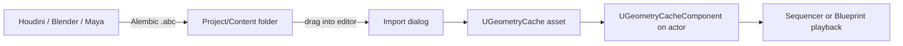

# Geometry Cache

**Asset class:** `UGeometryCache`
**Component:** `UGeometryCacheComponent`
**Plugin (built-in):** Alembic Importer
**Status:** stable since UE 4.21, production-ready in 5.7

Geometry Cache is Unreal's playback system for **pre-baked, per-vertex-per-frame animated meshes**. Where Skeletal Mesh deforms via a bone hierarchy, Geometry Cache replays the exact vertex positions captured in a DCC simulation — frame by frame, optionally interpolated.

## What it's for

| Use case | Why Geometry Cache |
| --- | --- |
| Cloth & soft-body simulations from Houdini / Marvelous Designer | No skeleton needed; topology can change |
| Fluid / pyro / FLIP simulations | Vertex count changes per frame are allowed |
| Destruction baked in Houdini | Captures the exact sim output |
| MetaHuman facial mocap (legacy path) | High vertex count, low-bone replay |
| Crowd cache replays | Cheaper than skel mesh per-instance |

For real-time simulations, use **Niagara Fluids**, **Chaos**, or **Cloth Asset (Dataflow)**. Geometry Cache is for *pre-baked* content.

## Pipeline



### Export from Houdini (recommended)

```hscript
# In a ROP_Alembic1 node:
# - Build Hierarchy From Attribute: path
# - Use Object Path Hierarchy: off
# - Frame Range: timeline
# - Pack Transform: World Space
# - Format: Ogawa
# - Face Sets: name
```

### Export from Blender

```
File → Export → Alembic (.abc)
  - Selected Objects: on
  - Flatten Hierarchy: on
  - Apply Subdivision Surface: as needed
  - UV Write / Normals: on
  - Frame Start / End: scene range
```

### Import to UE

1. Drag the `.abc` into the Content Browser.
2. In the import dialog choose **Geometry Cache** (not Static or Skeletal).
3. Key options:
   - **Material Slot:** auto from per-face-set or single
   - **Force Single Mesh:** for high-perf playback
   - **Compression:** Zlib for size, none for speed
   - **Flatten Tracks:** merges multi-object Alembics into one cache
   - **Optimize Index Buffer:** on for static topology, off if topology changes per frame

## Placing in a level

1. Drag the `UGeometryCache` asset into the viewport — it creates an `AGeometryCacheActor`.
2. Inspect the `GeometryCache` component for:
   - **Start Time Offset**
   - **Playback Speed**
   - **Looping**
   - **Override Wireframe Color**
   - **Motion Vector Scale** (for TSR / motion blur)

## Sequencer integration

Geometry Cache is a first-class Sequencer track:

1. Add the actor to your Level Sequence
2. `+ Track → Geometry Cache`
3. Keyframe `Start Time Offset`, `Playback Speed`, or use the **Geometry Cache Section** for scrub-frame control

## Materials

- Per-face-set Alembic exports become per-slot materials automatically.
- For **changing topology**, use **two-sided** + disable lightmaps; baked GI is impossible with topology change.
- Lumen GI handles dynamic Geometry Cache transparently in UE 5.x.

## Performance

| Lever | Effect |
| --- | --- |
| **Compression** | Trades disk size for CPU decode cost |
| **Force Single Mesh** | One draw call per frame instead of N |
| **Motion Vectors** | Required for TSR/TAA — small cost |
| **Stream from Disk** | Off-loads memory; needs SSD |
| **GPU Skinning** | Auto for fixed-topology caches |

**Memory:** ~`vertices × 12 bytes × frames` uncompressed. A 100k-vertex 240-frame cache ≈ 280 MB before compression, ~50 MB Zlib.

## API examples

```cpp
#include "GeometryCacheComponent.h"
#include "GeometryCache.h"

UGeometryCacheComponent* Comp = NewObject<UGeometryCacheComponent>(this);
Comp->SetGeometryCache(LoadObject<UGeometryCache>(nullptr,
    TEXT("/Game/FX/MyCache.MyCache")));
Comp->SetStartTimeOffset(0.f);
Comp->SetLooping(true);
Comp->Play();
```

```python
import unreal
asset = unreal.load_asset('/Game/FX/MyCache')
actor = unreal.EditorLevelLibrary.spawn_actor_from_object(asset,
    unreal.Vector(0,0,0))
```

## Gotchas

- **Vertex count differences per frame** disable GPU skinning; CPU path is much slower.
- **Lightmaps** are not supported. Use Lumen.
- **Collision** is per-frame trace against bounds only. For collidable destruction use **Chaos Destruction** instead.
- **Editor scrubbing** can be slow on large caches — toggle "Disable Editor Preview" on the component while editing other things.
- **Niagara cannot read Geometry Cache vertex data directly** — bake to a `Vertex Animation Texture` (VAT) via the Animation Asset toolkit if you need particle attachment.

## Modern alternatives

| Need | Use instead |
| --- | --- |
| Real-time cloth | **Cloth Asset (Dataflow)** in UE 5.7 |
| Real-time fluids | **Niagara Fluids** |
| Real-time destruction | **Chaos Destruction** |
| Film-grade huge scenes | **USD** with `UsdStageActor` |
| Per-particle baked motion | **Vertex Animation Texture (VAT)** |

## Links

- [UE docs — Geometry Cache](https://docs.unrealengine.com/5.0/en-US/geometry-caches-in-unreal-engine/)
- [Alembic format spec](https://www.alembic.io/)
- [UGeometryCache source](https://github.com/EpicGames/UnrealEngine/blob/release/Engine/Source/Runtime/GeometryCache/Public/GeometryCache.h)
