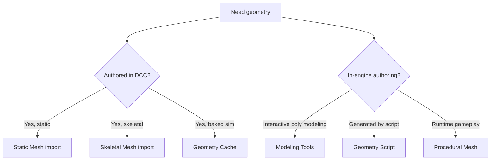

# Geometry

Everything mesh-shaped. Four authoring paths in UE 5.7:

| Path | What it's for | Page |
| --- | --- | --- |
| **Static / Skeletal Mesh import** | Standard DCC → glTF / FBX → UE | (Catalog) |
| **Geometry Cache** | Pre-baked Alembic sims | [→](geometry-cache.md) |
| **Modeling Tools** | In-editor poly modeling, retopo | [→](modeling-tools.md) |
| **Geometry Script** | Programmatic mesh authoring (BP / Python / C++) | [→](geometry-script.md) |
| **Procedural Mesh Component** | Runtime dynamic meshes for gameplay | [→](procedural-meshes.md) |

## Choosing between them

## Nanite

Almost any static mesh should ship as Nanite in UE 5.7 — see [Nanite](../rendering/nanite.md). The geometry path matters less than whether the asset is marked Nanite-enabled.

## Pages

- [Geometry Cache](geometry-cache.md) — Alembic playback
- [Nanite Geometry](nanite-geometry.md) — Nanite-specific authoring
- [Modeling Tools](modeling-tools.md) — in-editor modeling
- [Geometry Script](geometry-script.md) — scripted authoring
- [Procedural Meshes](procedural-meshes.md) — runtime gameplay meshes
