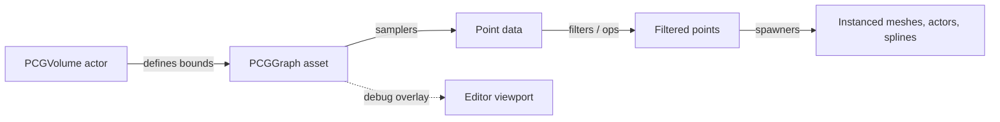

# PCG — Procedural Content Generation

PCG is Unreal's native, graph-driven procedural content system. Introduced in 5.2, hardened in 5.3, fully production in **UE 5.7** with Biomes and Subdivision shipping as separate plugins. It replaces hand-painted Foliage, custom Houdini-Engine pipelines for level dressing, and most spline-based scattering tools.

## Plugins to enable

| Plugin | Role |
| --- | --- |
| **Procedural Content Generation Framework** | Core graph system, nodes, runtime |
| **PCG Geometry Script Interop** | Generate / sample meshes from PCG |
| **PCG Examples** | Reference graphs you can dissect |
| **PCG Biomes** | Layered biome blending |
| **PCG Subdivision** | Recursive partitioning operators |

Enable under `Edit → Plugins → search "PCG"`, restart.

## Mental model



- **Graphs** are `.uasset` files you edit in a node graph.
- **Points** are the universal data type — a position, rotation, scale, density, and attribute bag.
- **Bounds** come from a `PCGVolume` actor or any actor with a `PCGComponent`.
- **Generation** is triggered manually in the editor, on actor spawn, or per **World Partition** cell at runtime.

## Pages

- [Graph basics](graph-basics.md) — anatomy of a `PCGGraph`
- [Samplers and spawners](samplers-and-spawners.md) — how to turn bounds into populated meshes
- [Volumes and bounds](volumes-and-bounds.md) — how `PCGVolume` interacts with World Partition
- [Biomes](biomes.md) — layered density-based blending
- [World Partition](world-partition.md) — per-cell PCG generation at runtime

## Why use PCG over Foliage / Procedural Foliage Volume

| Concern | Foliage | PCG |
| --- | --- | --- |
| Authoring | Paint each species | Graph-driven, parametric |
| Re-runnability | Manual repaint | Re-runs on world change |
| Multi-layer rules (e.g. "trees only on slopes < 30° not under power lines") | Hard | Trivial |
| Runtime generation | No | Yes, per WP cell |
| Diff / version control | Painted state is huge data | Graph is a small uasset |
| AI / scripting integration | None | Full Python + Blueprint API |

## Typical first graph

The "scatter trees on a heightfield within a volume" graph fits in 6 nodes:

```
SurfaceSampler (Landscape) → Density Filter (slope < 30°) → Random Selection
  → Static Mesh Spawner (Trees Asset Set) → Output
```

Add a `Difference` node fed by a road spline to carve out a no-spawn zone, and you've replaced an afternoon of manual placement with a re-runnable rule.

## What ships in the box

| Folder | Contents |
| --- | --- |
| `Engine/Plugins/PCG/Content/Examples/` | Five reference graphs (forest, grass, urban, biome, debug) |
| `Engine/Plugins/PCG/Content/Blueprints/` | Reusable subgraph BPs |
| `Engine/Plugins/PCG/Content/Misc/` | Test sets, point data, splines |

See also:

- [`docs/volumes/pcg-volume.md`](../volumes/pcg-volume.md) — bounding actor specifics
- [`docs/tools/world-partition.md`](../tools/world-partition.md) — runtime per-cell generation
- [UE official PCG docs](https://docs.unrealengine.com/5.7/en-US/procedural-content-generation-overview/)
