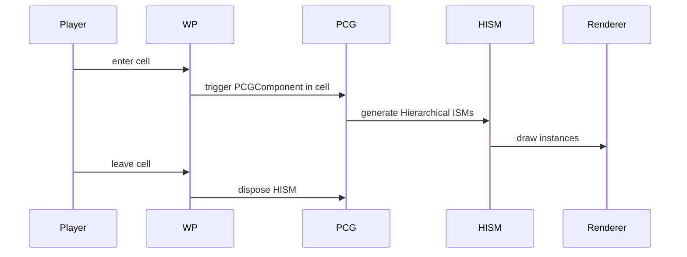

# PCG + World Partition

In a World Partition map, PCG can generate content **per cell at runtime** — keeping memory bounded and supporting huge open worlds.

## Setup

1. World Partition enabled on your map
2. Place a PCG Volume (or PCGComponent on an actor) and set:
   - **Generate On Load = false**
   - **Generation Trigger = GenerateAtRuntime**
   - **Use Hierarchical Generation = true**
3. Set the PCG Component's `Grid Size` to match your World Partition cell grid (default 25,600 cm)

## Lifecycle

## Determinism

Each cell uses **(world_seed XOR cell_coord)** as the seed. Neighboring cells produce content that matches at the boundary — see [Volumes and Bounds → Determinism across cells](volumes-and-bounds.md#determinism-across-cells).

## Performance tuning

| Lever | Effect |
| --- | --- |
| Cell size | Smaller cells = finer streaming, more overhead per cell boundary |
| **Hierarchical Generation** | Larger features generated at coarse cells, details at fine cells |
| **Cull Distance per HISM** | Drop distant instances even within active cells |
| **PCG Component LOD** | Lower-density graph in distant cells, swap up close |

## Streaming costs

Generation is on a background thread when possible, but the GPU upload of HISM data happens on the main thread. Budget for ~2–10 ms per cell load on typical hardware.

## Hierarchical Generation

Run a "coarse pass" (e.g. mountain meshes, distant trees) on large cells, and a "fine pass" (grass, debris) on small cells. Configure per-graph under **Component → Hierarchical Generation Settings**.

## Gotchas

- **Editor preview** doesn't always match runtime — toggle "Simulate World Partition" to see the runtime behavior.
- **Cell boundaries** show seams if your samplers don't include a small overlap. Use the **Bounds Extents** field on samplers.
- **Lumen + HISM** can take a frame to update GI when a cell streams in — pre-warm via `Lumen Probe Volume`.
