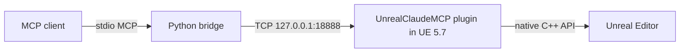

# UnrealClaudeMCP

A UE editor plugin that exposes 64+ native C++ handlers as **MCP (Model Context Protocol)** tools, letting any MCP-compliant client (Claude Code, Cursor, Codex CLI, Continue, Cline, Zed, Gemini CLI, VS Code Copilot) drive the editor over a local TCP socket.

> See also: [AI Integration → UnrealClaudeMCP](../ai-integration/unreal-claude-mcp.md) for the per-tool reference.

## Architecture



| Piece | Where |
| --- | --- |
| Editor module | `<Project>/Plugins/UnrealClaudeMCP/Source/UnrealClaudeMCP/` |
| Python bridge | `bridge/unreal_claude_mcp_bridge.py` |
| Manifest | `UnrealClaudeMCP.uplugin` (lists 64 native handlers + 4 bridge-side composites) |

## Tool categories

- Python execution (one-shot, persistent, file-based, selection-bound)
- Project / asset registry (find, inspect, move, rename, delete)
- Blueprint / Widget / Animation introspection
- Material / Texture authoring
- Level Sequences
- Level / actor authoring (spawn, transform, property, component, focus)
- Viewport screenshots
- Console & log access
- Long-running tasks
- Event push / subscriptions

## Drop into a project

1. Copy `UnrealClaudeMCP/` into `<YourProject>/Plugins/`
2. Right-click `.uproject` → Generate VS project files
3. Open the `.sln`, build **Development Editor | Win64**
4. Launch the editor — log shows:
   ```
   [LogUnrealClaudeMCP] Module started
   LogUCMCPHandler: Registered handler 'execute_unreal_python'
       ... (64 lines)
   [LogUCMCP] Listening on 127.0.0.1:18888
   ```

## Wire any MCP client

`.cursor/mcp.json` example:

```json
{
  "mcpServers": {
    "unreal-claude": {
      "command": "py",
      "args": ["C:/Path/To/UnrealClaudeMCP/bridge/unreal_claude_mcp_bridge.py"]
    }
  }
}
```

Same recipe works for Claude Desktop (`claude_desktop_config.json`), Codex CLI (`codex mcp add`), Continue (`~/.continue/config.yaml`), Zed (`~/.config/zed/settings.json`), Gemini CLI (`~/.gemini/settings.json`).

## Quick test (no client needed)

```bash
py examples/smoke_test.py
```

Fires every default-on tool; ends with "Smoke test complete." if the plugin is alive.

## See also

- [AI Integration → UnrealClaudeMCP](../ai-integration/unreal-claude-mcp.md) — full tool reference
- [Unreal AI Connection](../ai-integration/unreal-ai-connection.md) — 105-tool fork
