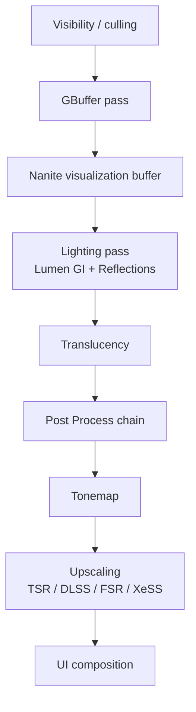

# Rendering

The UE 5.7 renderer is a hybrid deferred + ray-traced pipeline with three tentpole technologies:

- **Nanite** — virtualized micropolygon geometry. Renders multi-million-triangle meshes without LODs.
- **Lumen** — software / hardware ray-traced global illumination and reflections.
- **Virtual Shadow Maps (VSM)** — single 16K-resolution virtualized shadow per light.

On top of those, the pipeline supports:

| System | Page |
| --- | --- |
| Streaming Virtual Textures + Runtime Virtual Textures | [→](virtual-textures.md) |
| Render Targets | [→](render-targets.md) |
| Path Tracer (reference renderer for cinematics) | [→](path-tracing.md) |
| Real-time DXR / Vulkan RT | [→](ray-tracing.md) |
| Pixel Streaming (WebRTC video out) | [→](pixel-streaming.md) |
| Post Process pipeline | [→](post-process.md) |

## Render order at a glance

## CVar quick reference

| CVar | Effect |
| --- | --- |
| `r.Lumen.HardwareRayTracing 1` | Switch Lumen to hardware RT |
| `r.Nanite.MaxPixelsPerEdge 1` | Maximum Nanite quality |
| `r.ScreenPercentage 100` | Internal resolution percent |
| `r.AntiAliasingMethod 2` | 0=off 1=FXAA 2=TAA 3=MSAA 4=TSR |
| `r.RayTracing.GlobalIllumination.Brute Force` | Reference RTGI for comparison |
| `r.Shadow.Virtual.Enable 1` | Virtual Shadow Maps |
| `r.PathTracing 1` | Path tracer mode |

## Hardware paths

| Tier | Path | Targets |
| --- | --- | --- |
| Low | Forward Shading + baked lighting | Mobile, Switch |
| Mid | Deferred + Lumen software | Last-gen consoles, integrated GPUs |
| High | Deferred + Lumen HWRT + Nanite | PC RTX 2070+, PS5, Xbox Series X |
| Top | Path Traced offline | Cinematics, Movie Render Queue |
