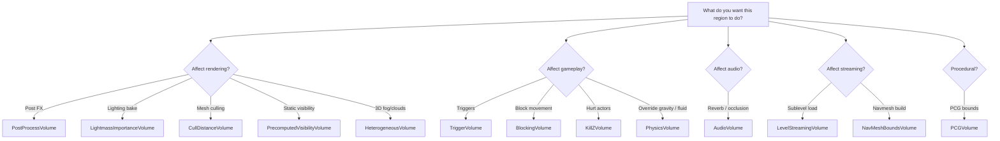

# Volumes

Volumes are **bounded region actors** that affect what's inside them. They share a common base — `AVolume` — and differ only in what their bounding region *does*. UE 5.7 ships ~15 production volume types covering post-FX, gameplay, navigation, audio, streaming, and volumetric rendering.

## The catalog

| Volume | Purpose | Pages |
| --- | --- | --- |
| **PostProcessVolume** | Per-region post FX, exposure, bloom, color grading | [→](post-process-volume.md) |
| **TriggerVolume / TriggerBox** | Gameplay overlap triggers | [→](trigger-volumes.md) |
| **BlockingVolume** | Invisible collision | [→](trigger-volumes.md#blocking-volume) |
| **PhysicsVolume** | Override gravity / damping / fluid for actors inside | [→](physics-volumes.md) |
| **AudioVolume** | Reverb effect + audio occlusion zone | [→](audio-volumes.md) |
| **NavMeshBoundsVolume** | Defines where navmesh is built | [→](navmesh-volumes.md) |
| **CullDistanceVolume** | Per-region culling distances by mesh size | [→](cull-distance.md) |
| **LightmassImportanceVolume** | Restrict Lightmass GI to important regions | [→](cull-distance.md#lightmass) |
| **PrecomputedVisibilityVolume** | Bake static visibility for low-end perf | [→](cull-distance.md#pvs) |
| **LevelStreamingVolume** | Stream sublevels in/out by player presence | [→](streaming-volumes.md) |
| **PCGVolume** | Bounds for PCG generation | [→](pcg-volume.md) |
| **HeterogeneousVolume / SparseVolumeTexture** | True 3D voxel volumes for clouds, smoke, OpenVDB | [→](heterogeneous-volumes.md) |
| **KillZVolume / PainCausingVolume** | Damage / kill regions | [→](trigger-volumes.md#painful-volumes) |
| **MeshMergingVolume** | Auto-merge static meshes inside for HLOD | [→](cull-distance.md#hlod) |

## Common ancestry

Every volume inherits from `AVolume → ABrush → AActor`. The bounding shape comes from a `UBrushComponent` and is editable with the geometry editing tool (`Mode Selector → Brush`). Most volumes also accept **convex shape components** for non-box bounds.

## Quick decision tree

## Per-page deep dives

Each volume page covers:

1. What it does
2. Required plugins (if any)
3. Properties cheat-sheet
4. Blueprint events / C++ hooks
5. Gotchas
6. Cross-links to related systems

Start with the most-used: [PostProcessVolume](post-process-volume.md), [TriggerVolume](trigger-volumes.md), [AudioVolume](audio-volumes.md), [PCGVolume](pcg-volume.md), [HeterogeneousVolume](heterogeneous-volumes.md).
