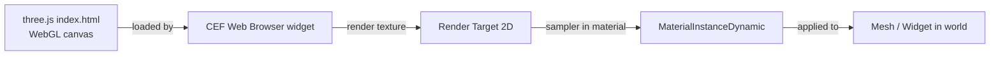

# Running three.js inside Unreal Engine

Render an actual three.js scene (HTML canvas + WebGL) as a live surface inside UE 5.7.

## Plugin options

| Plugin | Type | Pros | Cons |
| --- | --- | --- | --- |
| **Web Browser + Web Browser Widget** | Built-in | Free, in the box | CEF-based, render-to-widget only |
| **WebUI** (tracerinteractive) | Community ★ | Render-to-material, modern CEF | Community-maintained |
| **Ultralight UE** | Community | Lower memory | Limited WebGL |
| **Coherent Gameface** | Marketplace | AAA-grade | Enterprise pricing |

## Architecture



## Recipe — built-in Web Browser

1. **Enable plugins**: `Web Browser`, `Web Browser Widget` → restart
2. **Place the three.js scene**: `<Project>/Content/UI/three/index.html` with bundled JS / `three.module.js`
3. **Widget Blueprint** — drag a `WebBrowser` widget onto canvas; set initial URL to `file:///%GAMEDIR%/Content/UI/three/index.html`
4. **3D placement** — drop a `WidgetComponent` on an actor, set `Widget Class = your UMG widget`, **Widget Space = World**
5. **Tune**: `Draw Size = 2048×1024`, **Pivot = (0.5, 0.5)**

For render-to-material (paint the three.js scene on any mesh face):

```cpp
WidgetComp->SetWidgetClass(MyWidgetClass);
WidgetComp->SetDrawSize(FVector2D(2048,1024));
WidgetComp->SetWidgetSpace(EWidgetSpace::World);
WidgetComp->SetTwoSided(true);
// internal: WidgetComp creates a render target you can sample via the material
```

Then in a Material:

- Add `Texture Sample` referencing the WidgetComponent's render target
- Connect to **Emissive Color**

## Recipe — WebUI

WebUI exposes a Material that already samples the live CEF surface. Drop `MIDWebUI` on any mesh — done.

```cpp
UWebUIComponent* Web = NewObject<UWebUIComponent>(this);
Web->URL = TEXT("file:///%GAMEDIR%/Content/UI/three/index.html");
Web->RegisterComponent();
Mesh->SetMaterial(0, Web->CreateMaterialInstanceForSurface());
```

## Communicating UE ↔ three.js

CEF exposes `cefQuery`-style messaging. From JS:

```js
window.ueQuery({
  request: JSON.stringify({ event: 'onSpawn', x: 5, y: 0 }),
  onSuccess: r => console.log(r),
  onFailure: e => console.error(e),
});
```

From UE Blueprint, bind the **OnUrlChanged / OnJavaScriptDialog** delegate or use the WebUI bridge to receive JSON messages.

## Audio

CEF browser has its own audio output — routed to OS audio. If you need UE's audio system to capture it:

1. WASAPI loopback capture (Windows) → write to a `USoundWaveProcedural`
2. Or use a media source via **Media Framework** with a WebRTC bridge

## Limitations

- **CEF transparency** depends on the build — not all transparent backgrounds render through
- **WebGL2** works; **WebGPU** is iffy depending on CEF version
- **Performance**: each browser surface is a separate Chromium process; 4K canvases at 60Hz are noticeable cost

## Better alternatives in some cases

- **Spout**: run three.js in an Electron window with Spout4three.js, pipe the GPU texture directly to UE. No CEF tax, sub-frame latency.
- **NDI**: same idea over network — useful for cross-machine three.js → UE.

## See also

- [Pixel Streaming](../rendering/pixel-streaming.md) — the *reverse* direction
- [UE in three.js](ue-in-three-js.md)
- [Plugins → UI](../plugins/ui.md)
